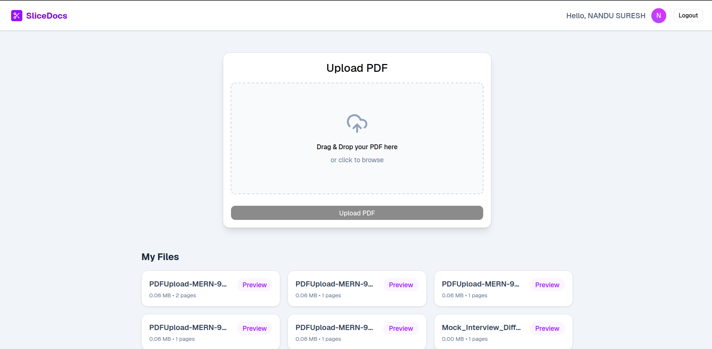
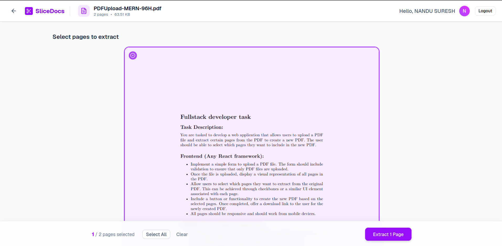

# SliceDocs 📄✂️



SliceDocs is a full-stack web application designed to easily extract, slice, and manage your PDF documents. Built with a modern tech stack, it provides a seamless user experience for document manipulation and cloud storage.

## 🚀 Live Demo

Check out the live application here: **[https://slicedocs.nandusuresh.online](https://slicedocs.nandusuresh.online)**

## 🌟 Features

* **PDF Extraction & Slicing:** Easily extract specific pages or split large PDF files using `pdf-lib`.
* **Google Authentication:** Secure and quick login using Google OAuth.
* **Cloud Storage:** Securely store and manage your uploaded and processed documents using AWS S3.
* **Modern Interface:** A clean, responsive UI built with React, Vite, and TailwindCSS.
* **Interactive PDF Viewer:** Preview your PDFs directly in the browser with `react-pdf`.



## 🛠️ Tech Stack

**Frontend (Client):**
* React 19 (Vite)
* TailwindCSS & Shadcn/Base-UI
* Zustand (State Management)
* React-PDF / PDF.js

**Backend (Server):**
* Node.js & Express
* MongoDB (Mongoose)
* PDF-lib
* AWS S3 SDK
* JWT Authentication

## 💻 Getting Started (Clone and Run Locally)

Follow these instructions to set up the project locally.

### Prerequisites
* Node.js installed on your machine
* MongoDB instance (local or Atlas)
* AWS S3 Bucket credentials
* Google OAuth Client ID

### 1. Clone the repository

```bash
git clone <your-repository-url>
cd SliceDocs
```

### 2. Setup the Backend (Server)

```bash
cd server
npm install
```

* Create a `.env` file in the `server` directory (you can use `.env.example` as a reference) and add your environment variables (MongoDB URI, AWS credentials, JWT Secret, Google Auth credentials, etc.).

* Start the development server:
```bash
npm run dev
```

### 3. Setup the Frontend (Client)

Open a new terminal window/tab:

```bash
cd client
npm install
```

* Create a `.env` file in the `client` directory and add your required frontend environment variables (e.g., API Base URL, Google Client ID).

* Start the development client:
```bash
npm run dev
```

The client should now be running on `http://localhost:5173` and the backend on the port specified in your `.env`.

## 🤝 Contributing

Contributions, issues, and feature requests are welcome!

## 📝 License

This project is licensed under the ISC License.
